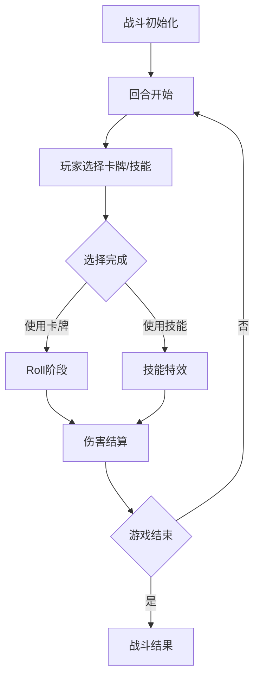

# 命运赌局 - 技术架构文档

## 1. 技术选择

| 类别 | 技术 | 版本 | 选型理由 |
|------|------|------|----------|
| 核心框架 | 微信小程序 | - | 已有的项目框架，用户要求保持 |
| 样式 | WXSS | - | 微信小程序原生样式系统 |
| 状态管理 | 本地存储 + 页面状态 | - | 简化实现 |
| 动画 | CSS动画 + Canvas | - | 高性能动画效果 |

## 2. 文件结构设计

项目结构采用微信小程序标准结构，组织如下：

```text
d:/work/miniGamDemo/
├── pages/              # 页面
│   ├── index/          # 主菜单
│   ├── battle/         # 战斗页面
│   └── encyclopedia/   # 卡牌百科
├── components/         # 组件
│   ├── CardComponent/  # 卡牌组件
│   ├── BossComponent/  # Boss组件
│   └── EffectComponent/# 特效组件
├── assets/
│   ├── scripts/        # 游戏逻辑
│   └── images/         # 图片资源
├── app.js
├── app.json
├── app.wxss
└── project.config.json
```

### 2.1 目录结构

| 模块 | 主要职责 | 文件位置 | 
|------|----------|----------|
| 主菜单 | 游戏入口，职业选择 | pages/index/ |
| 战斗 | 核心战斗逻辑 | pages/battle/ |
| 卡牌百科 | 卡牌展示 | pages/encyclopedia/ |
| 卡牌组件 | 卡牌显示和交互 | components/CardComponent/ |
| Boss组件 | Boss显示和阶段切换 | components/BossComponent/ |
| 特效组件 | 战斗特效动画 | components/EffectComponent/ |

## 3. 数据结构设计

### 3.1 本地存储设计

| 数据名称 | 数据结构 | 存储位置 | 说明 |
|---------|----------|----------|------|
| 玩家存档 | PlayerSave | wx.setStorage | 记录游戏进度 |
| 设置 | GameSettings | wx.setStorage | 用户偏好设置 |

### 3.2 类型定义

```typescript
// 游戏类型定义

interface PlayerSave {
  playerClass: string;
  currentHp: number;
  deck: string[];
  unlockedCards: string[];
}

interface GameSettings {
  soundEnabled: boolean;
  animationSpeed: number;
}

interface Card {
  id: string;
  name: string;
  description: string;
  rarity: 'common' | 'rare' | 'epic' | 'legendary' | 'curse';
  rollRange: { min: number; max: number };
  speed: number;
  effects: Effect[];
  class: string;
}

interface Effect {
  type: string;
  value: any;
}

interface Enemy {
  id: string;
  name: string;
  faction: string;
  hp: number;
  maxHp: number;
  shield: number;
  phase: number;
}

interface BattleState {
  turn: number;
  player: Player;
  enemy: Enemy;
  battleLog: string[];
}

interface Player {
  hp: number;
  maxHp: number;
  shield: number;
  hand: Card[];
  skillCooldown: number;
}
```

## 4. 功能模块拆解与技术实现

### 4.1 主菜单页面

| 模块名称 | 功能说明 | 技术实现 |
|----------|----------|----------|
| 背景动画 | 动态赌场背景 | CSS动画 + Canvas粒子效果 |
| 职业选择 | 四个职业卡片 | Flex布局，悬浮动画 |
| 按钮交互 | 开始游戏 | Tap事件，页面跳转 |

### 4.2 战斗页面

| 模块名称 | 功能说明 | 技术实现 |
|----------|----------|----------|
| 敌人信息 | HP/护盾显示 | 进度条组件，平滑动画 |
| Roll区域 | 数字对撞 | CSS动画，屏幕震动 |
| 手牌区域 | 卡牌选择和使用 | 横向滚动，点击事件 |
| 技能按钮 | 技能释放 | 状态管理，冷却显示 |
| Boss演出 | 阶段切换动画 | 序列帧动画，特效叠加 |

### 4.3 卡牌组件

| 模块名称 | 功能说明 | 技术实现 |
|----------|----------|----------|
| 卡牌渲染 | 卡牌显示 | Flex布局，边框动画 |
| 稀有度标识 | 颜色编码 | 条件渲染，渐变背景 |
| 交互动画 | 悬停/点击效果 | CSS过渡，缩放动画 |
| 详情弹窗 | 卡牌信息展示 | 弹窗组件，模糊背景 |

### 4.4 特效组件

| 模块名称 | 功能说明 | 技术实现 |
|----------|----------|----------|
| 屏幕震动 | 战斗效果 | CSS transform动画 |
| 粒子效果 | 技能特效 | Canvas绘制 |
| 颜色滤镜 | 氛围效果 | CSS filter属性 |

## 5. 核心流程与技术实现路径

### 5.1 战斗流程



**状态流转说明：**
- **战斗初始化**: 加载敌人数据，初始化手牌
- **玩家选择**: 响应用户点击，验证卡牌可用性
- **Roll阶段**: 生成随机数，播放对撞动画
- **伤害结算**: 应用效果，更新HP/护盾
- **结果处理**: 胜利/失败，状态更新

## 6. 关键技术和依赖库

| 技术/库名 | 用途 | 项目中的应用 |
|----------|------|------------|
| WXSS | 样式系统 | 所有页面和组件的样式 |
| Canvas | 特效绘制 | 粒子效果、动画演出 |
| 微信小程序API | 系统功能 | 本地存储、动画API |

## 7. 配置和部署

### 7.1 项目配置

| 配置项 | 配置值 | 说明 |
|-------|--------|------|
| 小程序ID | 根据实际项目 | 开发者工具中配置 |
| 调试基础库 | 2.0.0+ | 最新稳定版本 |
| 编译配置 | ES6转ES5 | 兼容旧版本 |

### 7.2 部署流程

使用微信开发者工具上传代码包，提交审核后发布。

## 8. 监测与维护

- 使用微信小程序自带的异常监控
- 本地错误日志记录
- 性能关键节点：卡牌渲染、战斗特效、状态更新
