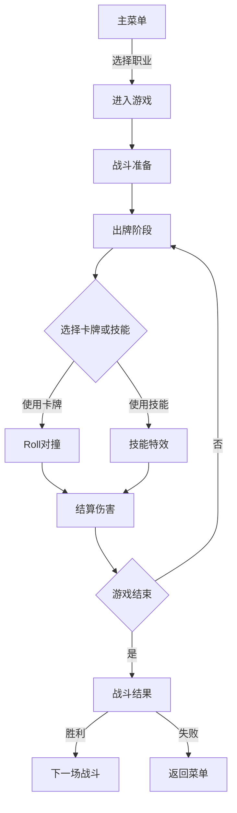

# 命运赌局 - 产品需求文档

## 1. 产品概览

命运赌局是一款暗黑赌场风格的卡牌RPG游戏，强调心理博弈和强力演出效果。

- **目标用户**：20-35岁的卡牌游戏爱好者，喜欢暗黑风格和策略游戏
- **产品价值**：提供独特的赌博感和心理博弈体验
- **成功标准**：具有独特的视觉风格，流畅的战斗体验，丰富的游戏内容

## 2. 核心功能

### 2.1 用户角色

| 角色 | 注册方式 | 角色权限 |
|------|----------|----------|
| 玩家 | 本地存档 | 所有游戏功能 |

### 2.2 功能模块

我们的命运赌局游戏包含以下主要页面：

1. **主菜单页面**：游戏入口，职业选择
2. **战斗页面**：核心战斗，卡牌使用，技能释放
3. **卡牌百科页面**：查看所有卡牌
4. **地图页面**：Roguelike探索（规划中）

### 2.3 页面详情

| 页面名称 | 模块名称 | 功能描述 |
|----------|----------|----------|
| 主菜单 | 菜单展示 | 显示游戏标题，开始游戏按钮 |
| 主菜单 | 职业选择 | 选择玩家职业（赌徒、魔术师、处刑者、狂徒） |
| 战斗 | 敌人信息 | 显示敌人HP、护盾、状态 |
| 战斗 | Roll区域 | 显示双方Roll值，对撞效果 |
| 战斗 | 手牌区域 | 显示玩家手牌，可选择使用 |
| 战斗 | 技能按钮 | 释放职业技能 |
| 战斗 | Boss演出 | 阶段切换动画，技能特效 |
| 卡牌百科 | 职业筛选 | 按职业筛选显示卡牌 |
| 卡牌百科 | 卡牌详情 | 点击查看卡牌详情 |

## 3. Core Process

### 游戏流程



玩家从主菜单开始，选择职业后进入战斗。在战斗中，玩家可以选择使用卡牌或技能，然后双方进行Roll对撞，结算伤害。循环直到一方HP降为0。

## 4. 用户接口设计

### 4.1 设计风格

- **主色调**：暗黑 (#0D0D0D)、深红 (#B3001B)、金色 (#D4AF37)、霓虹紫 (#8A2BE2)、疯狂红 (#FF2E63)
- **按钮样式**：发光描边，hover放大，红金渐变
- **字体**：独特的游戏字体，高对比度
- **布局风格**：暗黑赌场舞台布局，上下分区，强视觉层次
- **图标风格**：简约但有冲击力，带发光效果
- **动画**：强烈的入场/离场动画，屏幕震动，粒子效果

### 4.2 页面设计概览

| 页面名称 | 模块名称 | UI元素 |
|----------|----------|----------|
| 主菜单 | 菜单展示 | 暗黑赌场背景，巨型命运轮盘，漂浮扑克，霓虹灯效果 |
| 主菜单 | 职业选择 | 四个职业卡片，金色边框，悬停发光效果 |
| 战斗 | 敌人信息 | 顶部敌人头像，HP条，护盾条，Boss阶段标识 |
| 战斗 | Roll区域 | 中央舞台，巨型数字，对撞特效，屏幕震动 |
| 战斗 | 手牌区域 | 底部卡牌展示，可点击选择，金色发光边框 |
| 战斗 | 技能按钮 | 发光按钮，冷却显示，释放动画 |
| 卡牌百科 | 卡片列表 | 网格布局，职业筛选，卡片详情弹窗 |

### 4.3 自适应

游戏设计为微信小程序，主要支持竖屏模式，适配不同尺寸的手机屏幕。

| 设备类型 | 屏幕尺寸 | 适配策略 |
|----------|----------|----------|
| 手机 - 竖屏 | < 768px | 单列布局，触摸优化 |
| 手机 - 横屏 | > 768px | 保持竖屏布局，可能显示侧边栏 |

## 5. 核心数据结构

### 5.1 玩家数据结构

```typescript
interface Player {
  id: string;
  class: 'gambler' | 'magician' | 'executioner' | 'madman';
  hp: number;
  maxHp: number;
  shield: number;
  hand: Card[];
  deck: Card[];
  discardPile: Card[];
  skillCooldown: number;
  maxSkillCooldown: number;
}
```

### 5.2 卡牌数据结构

```typescript
interface Card {
  id: string;
  name: string;
  description: string;
  rarity: 'common' | 'rare' | 'epic' | 'legendary' | 'curse';
  rollRange: { min: number; max: number };
  speed: number;
  effects: Effect[];
  class: 'gambler' | 'magician' | 'executioner' | 'madman';
}
```

### 5.3 敌人数据结构

```typescript
interface Enemy {
  id: string;
  name: string;
  faction: string;
  hp: number;
  maxHp: number;
  shield: number;
  phase: number;
  activeCorruptions: Corruption[];
  currentCard: Card | null;
}
```

## 6. API 接口设计

游戏为本地运行，暂无外部API需求。

## 7. 数据埋点

暂不实现数据埋点功能。
